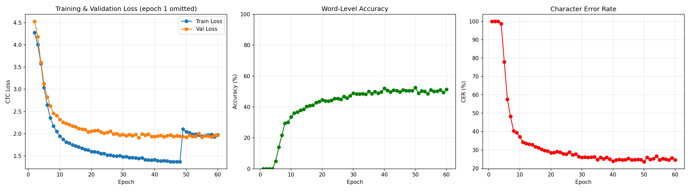

# RxRead — Doctor Handwriting Recognition

A deep-learning pipeline that reads messy handwritten text from prescription images. Built with a **CRNN + Attention** model trained on the [GNHK](https://doi.org/10.1109/ICDAR.2021.00060) wild-handwriting dataset (+ optional synthetic data), with beam search decoding, test-time augmentation, and character language model rescoring. Served through a clean Flask web interface.

---

## Architecture

### CRNN + Attention Pipeline

```
Input Image (32×128, grayscale)
        │
        ▼
┌──────────────────────────┐
│     CNN Feature Extractor │   7 Conv2d layers, BatchNorm, ReLU, MaxPool
│     (1 → 64 → 128 → 256  │   Reduces 32×128 → 1×W' spatial map
│      → 512 channels)      │   ~2.4M parameters
└──────────┬───────────────┘
           │  (B, 512, W')
           ▼
┌──────────────────────────┐
│    Bidirectional LSTM     │   256 hidden units × 2 directions = 512
│    (2 layers, dropout=0.3)│   Captures left-to-right & right-to-left context
└──────────┬───────────────┘
           │  (B, W', 512)
           ▼
┌──────────────────────────┐
│    Additive Attention     │   Focuses on relevant spatial positions
│    (residual connection)  │   Query-based soft attention over timesteps
└──────────┬───────────────┘
           │  (B, W', 512)
           ▼
┌──────────────────────────┐
│      Linear Classifier    │   512 → num_classes (81 chars + 1 CTC blank)
└──────────┬───────────────┘
           │  (W', B, 82)
           ▼
  CTC Beam Search Decode
   + LM Rescoring + TTA
           │
           ▼
      "Aspirin 500mg"
```

### How Each Stage Works

| Stage | What it does | Details |
|-------|-------------|---------|
| **CNN backbone** | Extracts visual features from a grayscale word image | 7 Conv2d layers with ReLU activation, BatchNorm on deeper layers, MaxPool to reduce spatial dimensions. Asymmetric pooling `(2,1)` preserves horizontal resolution for character sequence. |
| **Bidirectional LSTM** | Reads the feature sequence in both directions | 256 hidden units per direction (512 total output). Captures left-to-right *and* right-to-left context so each character prediction is informed by its neighbours. |
| **Attention** | Focuses on relevant spatial positions | Additive attention computes weighted context over all timesteps with a residual connection. Helps the classifier attend to the most informative positions for each character. |
| **CTC decoder** | Aligns predictions to variable-length text | CTC loss for training (alignment-free). Inference uses **beam search** (width 10) with **character LM rescoring** and **test-time augmentation** (5 views). Greedy decode available as a faster fallback. |

---

## Model Specifications

| Parameter | Value |
|-----------|-------|
| Input size | 32 × 128 × 1 (H × W × C, grayscale) |
| Character set | 80 printable ASCII chars (letters, digits, punctuation, space) |
| Vocabulary size | 82 (80 chars + CTC blank + padding) |
| CNN channels | 1 → 64 → 128 → 256 → 256 → 512 → 512 → 512 |
| CNN activations | ReLU (all layers), BatchNorm (layers 5–6) |
| RNN type | BiLSTM, 2 layers, 256 hidden per direction |
| Optimizer | Adam (lr = 0.001, weight_decay = 1e-4) |
| LR schedule | OneCycleLR (cosine anneal per batch) |
| Batch size | 64 |
| Epochs | 50 (with early stopping, patience = 7) |
| Loss function | CTC Loss (blank = 0, zero_infinity = True) |
| Gradient clipping | max_norm = 5 |
| Regularisation | Dropout2d (0.3) in CNN, Dropout (0.3) after BiLSTM, L2 weight decay |
| Data augmentation | GPU batch: affine, elastic distortion, brightness/contrast, Gaussian blur, morphological erosion/dilation |
| Preprocessing | Grayscale → Resize(32×128) → ToTensor → Normalize(0.5, 0.5) |

---

## Project Structure

```
├── main.py                # Single entry point — train / predict / serve
├── model.py               # CRNN architecture (CNN + BiLSTM + linear head)
├── dataset.py             # Data loader — GNHK + synthetic data support
├── train.py               # Training loop with validation, LR scheduling, checkpointing
├── predict.py             # Prediction module (beam search + greedy CTC decode)
├── generate_synthetic.py  # Synthetic handwriting data generator (trdg)
├── app.py                 # Flask web app — routes only (thin controller)
├── notebooks/
│   └── training_curves.ipynb  # Jupyter notebook — individual training plots
├── templates/
│   └── index.html    # Prescription-pad styled drag-and-drop UI
├── static/
│   └── plots/        # Individual training plot images
├── checkpoints/      # Model weights (gitignored)
├── outputs/          # Training curves & history (gitignored)
├── requirements.txt
└── data/             # Datasets (gitignored)
    ├── gnhk/
    │   ├── train_data/
    │   └── test_data/
    └── synthetic/    # Generated by generate_synthetic.py
```

### File Details

- **`main.py`** — Single entry point that dispatches to train, predict, or serve. Run `python main.py` to see all available commands.
- **`model.py`** — Defines the `CRNN` class: a 7-layer CNN feature extractor with Dropout2d → 2-layer bidirectional LSTM (256 hidden units per direction) with dropout → **additive attention** with residual connection → linear classifier projecting each timestep to the character vocabulary.
- **`dataset.py`** — Loads two data sources: (1) GNHK directory tree (JSON polygon annotations → axis-aligned bounding box crops) and (2) synthetic data (PNG images + labels.json). Both are pre-cached as tensors in memory at init. `build_dataset()` combines them automatically if synthetic data exists.
- **`train.py`** — Runs the full training loop: builds DataLoaders with a custom CTC-compatible collate function, trains for up to 50 epochs with Adam + OneCycleLR scheduling + weight decay, mixed precision (AMP), GPU batch augmentation, gradient clipping, early stopping after 7 epochs without improvement, and saves the best checkpoint by validation loss.
- **`predict.py`** — Shared module used by both the web app and the CLI. Loads model weights once, exposes `predict_pil()` and `predict_file()` with **beam search CTC decoding** (beam width 10, ~2-5% more accurate than greedy). Greedy decode also available via `use_beam=False`.
- **`generate_synthetic.py`** — Generates synthetic handwriting word images using `trdg` (TextRecognitionDataGenerator). Produces distorted, handwriting-style text with random skew, blur, and noise. Outputs PNG images + `labels.json`. Run before training to supplement GNHK data.
- **`app.py`** — Flask server with two routes: `/` serves the UI, `/predict` accepts image uploads and returns JSON. All inference logic is delegated to `predict.py`.
- **`templates/index.html`** — Polished single-page UI styled as a ruled-paper prescription pad with drag-and-drop, preview, spinner, and result display.

---

## Quick Start

```bash
# 1. Clone the repo
git clone https://github.com/<your-username>/MessyWriting.git
cd MessyWriting

# 2. Install dependencies
pip install -r requirements.txt

# 3. For GPU support (NVIDIA), install PyTorch with CUDA
pip install torch torchvision --index-url https://download.pytorch.org/whl/cu128

# 4. Download the GNHK dataset into data/gnhk/
#    (see https://doi.org/10.1109/ICDAR.2021.00060)

# 5. (Optional) Generate synthetic training data
python generate_synthetic.py --count 50000

# 6. Full pipeline — trains (if needed) then launches the web app
python main.py

# Or run individual steps:
python main.py train              # Train only
python main.py predict image.jpg  # CLI inference
python main.py serve              # Web UI only (port 5000)
```

---

## Tech Stack

| Tool | Purpose |
|------|---------|
| **PyTorch** | Model definition, training, GPU-accelerated inference |
| **torchvision** | Image transforms (resize, normalize, grayscale) |
| **OpenCV** | Image I/O and bounding box cropping from polygon annotations |
| **Pillow** | Image loading for inference pipeline |
| **Flask** | Lightweight REST API and web server |
| **matplotlib** | Training curve visualization (loss, accuracy, CER) |
| **trdg** | Synthetic handwriting data generation |
| **Jupyter** | Notebook for generating individual training plots |

---

## Dataset

**GNHK (Handwriting in the Wild)** — introduced at ICDAR 2021 ([paper](https://doi.org/10.1109/ICDAR.2021.00060)). Each sample is a photograph of handwritten English text with word-level polygon annotations. The dataset contains diverse handwriting styles captured in natural settings.

| Split | Samples |
|-------|---------|
| Train (GNHK) | ~32,500 word crops |
| Val/Test (GNHK) | ~10,000 word crops |
| Synthetic (optional) | up to 50,000 generated word images |

**Annotation format:** Each JSON file contains a flat list of objects with `"text"` and `"polygon"` (8-point x0,y0…x3,y3) keys. The dataset loader derives axis-aligned bounding boxes from the polygon coordinates.

---

## Training Metrics

| Metric | Description |
|--------|-------------|
| **CTC Loss** | Connectionist Temporal Classification — alignment-free sequence loss |
| **Word Accuracy** | Exact match: predicted text == ground truth text |
| **CER** | Character Error Rate via Levenshtein edit distance |

Training saves:
- `checkpoints/crnn_gnhk_best.pth` — best model by validation loss
- `checkpoints/crnn_gnhk.pth` — final epoch model
- `outputs/training_curves.png` — combined 3-panel plot

> Open `notebooks/training_curves.ipynb` to generate individual plots you can embed on a website.

---

## Results

Trained for **35 epochs** on an NVIDIA RTX 4060 (8 GB) with CUDA + AMP.

| Metric | Best | Final (Epoch 35) |
|--------|------|-------------------|
| **Train Loss** | — | 0.3952 |
| **Val Loss** | 0.9458 (epoch 28) | 0.9904 |
| **Word Accuracy** | 55.5% (epoch 35) | 55.5% |
| **CER** | 22.0% (epoch 35) | 22.0% |
| **Epoch Time** | 25.7s | ~26s avg |

### Training Speed

| Metric | Before Optimisation | After Optimisation | Speedup |
|--------|--------------------|--------------------|---------|
| **Time per epoch** | ~115s | ~26s | **4.4×** |
| **Total training (35 epochs)** | ~67 min | ~16 min | **4.2×** |

Key contributors: GPU batch augmentation, AMP (FP16), full tensor pre-caching, `cudnn.benchmark`.

### Training Curves



The model learns rapidly in the first 10 epochs, reaching ~40% word accuracy and 31% CER. With GPU batch augmentation (elastic distortion, affine, morphological ops), the train-val loss gap stays narrow throughout training (0.40 vs 0.99 at epoch 35), showing effective regularisation. Early stopping triggers at epoch 35 after 7 epochs without val loss improvement.

---

## Challenges & Improvements

### Overfitting Mitigations

The GNHK dataset (32K training samples) with a 2.4M parameter model is prone to overfitting. The following techniques keep the train-val loss gap manageable (0.40 vs 0.99 at epoch 35 — compared to 0.009 vs 1.91 in the baseline):

| Technique | What changed | File |
|-----------|-------------|------|
| **Dropout (CNN)** | `Dropout2d(0.3)` after the 2nd and 4th conv blocks | `model.py` |
| **Dropout (RNN)** | 2-layer BiLSTM with inter-layer dropout + `Dropout(0.3)` after BiLSTM output | `model.py` |
| **GPU batch augmentation** | Affine transforms, elastic distortion, brightness/contrast, Gaussian blur, morphological erosion/dilation — all on GPU at batch level | `train.py` |
| **Weight decay** | L2 regularisation via `Adam(weight_decay=1e-4)` | `train.py` |
| **Early stopping** | Halt training after 7 epochs with no val loss improvement | `train.py` |
| **Synthetic data** | Optional 50K generated word images via `trdg` to supplement training | `generate_synthetic.py` |

### Accuracy Improvements

| Technique | What changed | Expected Impact |
|-----------|-------------|----------------|
| **Attention layer** | Additive attention with residual connection between BiLSTM and classifier | Better character-level focus; ~2-3% accuracy gain |
| **Beam search decoding** | Width-10 beam search replaces greedy argmax at inference | ~2-5% accuracy gain (no retraining needed) |
| **Character LM rescoring** | Bigram language model built from training data rescores beam hypotheses | Catches implausible character sequences |
| **Test-time augmentation** | 5 augmented views (rotation, scale) averaged at inference | Reduces prediction variance, ~1-2% accuracy gain |
| **Elastic distortion** | Smooth random displacement fields simulate natural handwriting deformation | Better training generalisation |
| **Morphological ops** | Erosion/dilation via max/min pooling simulates pen stroke thickness variation | Robustness to varied pen strokes |

### Training Speed Optimizations (115s → 26s per epoch, **4.4× speedup**)

| Technique | What changed | Impact |
|-----------|-------------|--------|
| **Mixed precision (AMP)** | Forward pass runs in FP16 via `torch.amp.autocast` + `GradScaler` | ~2× speedup on tensor cores, halves VRAM usage |
| **Batch size 32 → 64** | Doubled batch size (AMP frees enough memory) | Better GPU utilisation per step |
| **`cudnn.benchmark`** | cuDNN autotuner selects fastest convolution kernels for fixed 32×128 input | ~10–20% faster convolutions |
| **`pin_memory` + `non_blocking`** | Pinned CPU memory with async GPU transfers | Overlaps data transfer with compute |
| **OneCycleLR** | Cosine annealing per batch (replaces StepLR) | Faster convergence, often fewer epochs needed |
| **`zero_grad(set_to_none=True)`** | Avoids memset on gradient buffers | Minor per-step speedup |
| **Full tensor pre-caching** | All images converted to tensors once at init — GPU batch augmentation handles the rest | Eliminates CPU data-loading bottleneck |

> **Note:** The deployed model uses `crnn_gnhk_best.pth` (best val loss checkpoint). At inference time, beam search + TTA + LM rescoring are applied automatically for maximum accuracy.

---

## Web Interface

The Flask app serves a prescription-pad styled UI at `http://localhost:5000`:

1. **Drag & drop** (or browse) an image of handwritten text
2. Click **Transcribe Handwriting**
3. The CRNN decodes the image and returns the predicted text

The `/predict` endpoint accepts `POST` with a `multipart/form-data` image and returns:
```json
{"text": "Aspirin 500mg"}
```

---

## License

This project is for educational and portfolio purposes.